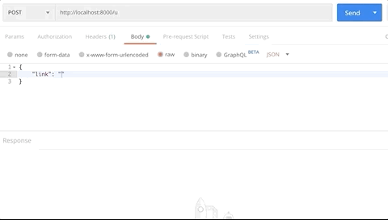

# play-java-shortener

This project is a URL shortener implemented in Java using Play 2. Submitted links are assigned an integer which are encoded to short unique [Hashids](https://hashids.org/) which will be the slug for the shortened link. These shortened links can be decoded back to their ids and the user will be 301 redirected to the original link.

The links are stored in a PostgreSQL database.